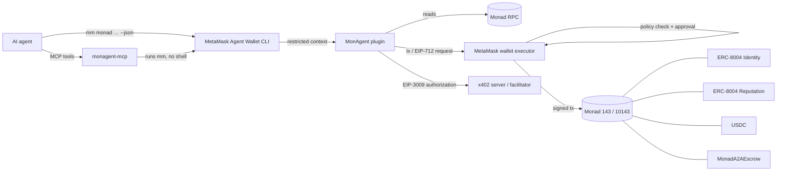

# MonAgent — MetaMask Agent Wallet Plugin for Monad

> Submission for the **Monad Metropolis Hackathon**, track *Best Agent Wallet Plugin* (MetaMask).

MonAgent adds agent-to-agent commerce to the **MetaMask Agent Wallet (`mm` CLI)** on **Monad Mainnet
(`143`)** and **Monad Testnet (`10143`)**. An AI agent can pay another agent, prove who it is, check a
counterparty's track record before trusting it, pay for API calls over x402, and hire other agents
through escrow. It does all of that without ever holding a private key: every transaction and
signature is executed and policy-checked by MetaMask.

```bash
npm install -g @metamask/agent-wallet@7
mm config set experimentalPlugins true
mm config set experimentalAllowUnverifiedInstalls true
mm plugins install @zakyirsyaad/monagent-plugin --accept-permissions
mm monad identity get 1 --chain-id 143
```

[Plugin on npm](https://www.npmjs.com/package/@zakyirsyaad/monagent-plugin) ·
[MCP server on npm](https://www.npmjs.com/package/@zakyirsyaad/monagent-mcp) ·
[Agent skill (SKILL.md)](./skills/monad-agent/SKILL.md) ·
[Use with AI agents](#use-with-ai-agents) ·
[Known limits](#known-limits)

---

## What an agent can do

| Need | Command | Built on |
|---|---|---|
| Pay another agent | `mm monad pay` | MON, USDC or any ERC-20 |
| Have an on-chain identity | `mm monad identity register` / `get` | Official ERC-8004 Identity Registry |
| Decide whether to trust a counterparty | `mm monad reputation check` | Official ERC-8004 Reputation Registry |
| Leave feedback after a job | `mm monad reputation give` | Official ERC-8004 Reputation Registry |
| Pay per call for a paid API or tool | `mm monad x402 pay` | x402 (`@x402/core`, `@x402/evm`), EIP-3009 USDC |
| Hire an agent with funds held in escrow | `mm monad jobs create` / `complete` / `refund` | `MonadA2AEscrow` (this repo) |

A typical flow: check the worker's reputation → fund an escrow job → release it when the work is
delivered → rate the worker. Each step is one `mm` command an agent can call with `--json`.

---

## How it works



- Commands extend the host's `PluginCommand` and declare their inputs with the host `InputSchema`, so
  every option is a regular CLI flag and works non-interactively.
- Reads go through the host's public client, falling back to the canonical Monad RPC on transport errors.
- Writes and signatures go through `ctx.walletExecutor`: the plugin builds the transaction or EIP-712
  payload, and MetaMask decides whether to sign it. Writes can pause for approval (`AWAITING_MFA`).

### Safety rules the plugin enforces
- **Testnet by default.** Every command uses `10143` unless `--chain-id 143` is passed. Other chain ids
  fail with `UNSUPPORTED_CHAIN` before anything is signed. For writes, pass `--chain-id 143` explicitly
  (see [Known limits](#known-limits)).
- **x402 signs exactly what it checked.** It only accepts a payment requirement on the requested chain,
  enforces `--maxSpend` on that requirement, signs only that one, then recovers the signer and aborts
  (`PAYER_MISMATCH`) if it isn't `--payer`. Nothing is sent to the server unless all checks pass.
- **Escrow funds move only on the client's decision.** Only the client can `complete` or `refund` a
  job; the worker can't pay itself. Escrow commands fail with `ESCROW_NOT_DEPLOYED` before any wallet
  prompt on chains without an escrow contract.
- **Read-only commands don't need a login**; write commands use the host's normal auth gate.

---

## Networks and contracts

| | Monad Testnet (`10143`) | Monad Mainnet (`143`) |
|---|---|---|
| CAIP-2 | `eip155:10143` | `eip155:143` |
| RPC | `https://testnet-rpc.monad.xyz/` | `https://rpc.monad.xyz/` |
| Explorer | `https://testnet.monadexplorer.com` | `https://monadexplorer.com` |
| ERC-8004 Identity Registry | `0x8004A818BFB912233c491871b3d84c89A494BD9e` | `0x8004A169FB4a3325136EB29fA0ceB6D2e539a432` |
| ERC-8004 Reputation Registry | `0x8004B663056A597Dffe9eCcC1965A193B7388713` | `0x8004BAa17C55a88189AE136b182e5fdA19dE9b63` |
| USDC (6 decimals) | `0x534b2f3A21130d7a60830c2Df862319e593943A3` | `0x754704Bc059F8C67012fEd69BC8A327a5aafb603` |
| MonadA2AEscrow | `0x8dcab9ddf394eb29cb891b264627bf60ea6af6ff` | not deployed (`ESCROW_NOT_DEPLOYED`) |

The ERC-8004 registries are the official deployments; the escrow is this repo's
[`contracts/src/MonadA2AEscrow.sol`](./contracts/src/MonadA2AEscrow.sol).

---

## Known limits

- **Writes on Monad Testnet (`10143`) don't go through MetaMask today.** With `@metamask/agent-wallet`
  7.0.0, the wallet service answers `Invalid chainId` (HTTP 400) when it estimates gas or tracks blocks
  for chain `10143`, so a write waits on `Submitting...` and nothing is sent. The plugin builds the
  transaction correctly and reads on testnet work. Use `--chain-id 143` for writes. This is a MetaMask
  service limit, not something the plugin can work around.
- **Escrow is testnet-only.** `MonadA2AEscrow` is deployed on `10143`, so `mm monad jobs …` can't complete
  a write through MetaMask right now (see above). The contract is covered by the Foundry tests and the
  contract simulation tests in this repo, and the commands fail early with `ESCROW_NOT_DEPLOYED` on mainnet.
- **A person is always in the loop for writes.** `mm login` and `mm init` are done once by a human, and
  each write can stop at `[AWAITING_MFA]` until it is approved in MetaMask. Agents and the MCP server
  can't (and shouldn't) bypass that.
- **`--walletAddress` and `--memo` are not stored on-chain** (see the command reference).

---

## Quickstart

Requires Node.js 22+ and `@metamask/agent-wallet` **6.2+ or 7.x**.

```bash
# 1. Install the MetaMask Agent Wallet CLI
npm install -g @metamask/agent-wallet@7

# 2. Allow plugins, then install MonAgent
mm config set experimentalPlugins true
mm config set experimentalAllowUnverifiedInstalls true
mm plugins install @zakyirsyaad/monagent-plugin --accept-permissions

# 3. Try a read (no login needed)
mm monad identity get 1 --chain-id 143

# 4. Sign in before any write command
mm login
mm init        # first run only
```

Writes need MON for gas on the chain you write to. Use mainnet (`--chain-id 143`) for writes, because
MetaMask currently rejects them on testnet (see [Known limits](#known-limits)). Reads on both chains need
no funds. Testnet MON, useful for experiments with reads and your own tools, is at
[faucet.monad.xyz](https://faucet.monad.xyz).

---

## Command reference

Every command accepts `--chain-id 10143|143` (default `10143`) and the host's output flags
(`--json`, `--format`, `--verbose`). Commands that send a transaction print its explorer link.

### Payments
```bash
# Native MON
mm monad pay --to 0x6beda6290a60a07ddb4Bf9D42A0D8d4E24E535Fa --amount 0.5 --token MON

# USDC on mainnet (6 decimals handled for you)
mm monad pay --to 0x6beda6290a60a07ddb4Bf9D42A0D8d4E24E535Fa --amount 10 --token USDC --chain-id 143

# Any ERC-20: the plugin checks the contract exists and reads decimals() on-chain
mm monad pay --to 0x6beda6290a60a07ddb4Bf9D42A0D8d4E24E535Fa --amount 25 --token 0x<token address> --chain-id 143
```
`--memo` is echoed in the command output only; it is not stored on-chain.

### Identity (ERC-8004)
```bash
mm monad identity register \
  --name "MonadArbitrageBot" \
  --description "High-speed DEX arbitrage agent" \
  --walletAddress 0x6beda6290a60a07ddb4Bf9D42A0D8d4E24E535Fa \
  --endpoint https://agent.example.com \
  --chain-id 143

mm monad identity get 1 --chain-id 143
```
`register` stores an ERC-8004 registration file (name, description, A2A and MCP service endpoints) as
the token URI and returns the new `agentId` from the `Registered` event. The registry's agent wallet
starts as the owner's address. `--walletAddress` is validated and echoed in the output, but it is not
written on-chain.

### Reputation (ERC-8004)
```bash
# Trust tier before you transact: HIGH (≥80), MEDIUM (≥50), LOW, or UNRATED
mm monad reputation check 1 --chain-id 143
mm monad reputation check 1 --tag1 speed

# Feedback from -100 to 100
mm monad reputation give --agentId 1 --value 95 --tag1 speed --tag2 reliability --chain-id 143
```
The official registry rejects feedback from an agent's own owner, so rate other agents, not yours.

### x402 paid calls
```bash
mm monad x402 pay \
  --url https://api.example.com/v1/predict \
  --method POST \
  --body '{"query":"market"}' \
  --maxSpend 100000 \
  --payer 0x<address of your active mm wallet> \
  --chain-id 143
```
- `--maxSpend` is in the token's base units: `100000` = 0.1 USDC, `1000000` = 1 USDC.
- `--payer` must be the wallet `mm` signs with; any mismatch aborts before payment.
- The server must offer an `exact` requirement on the chosen chain, otherwise `UNSUPPORTED_PAYMENT_NETWORK`.

### Escrow (deployed on testnet only; see Known limits)
```bash
mm monad jobs create --workerAddress 0x7777777777777777777777777777777777777777 \
  --bountyMon 0.1 --taskDescription "Generate neural embeddings" --deadlineHours 24

mm monad jobs complete 1 --resultURI ipfs://<deliverable>   # client releases the bounty
mm monad jobs refund 1                                      # client, after the deadline
```

---

## Use with AI agents

Any agent that can run shell commands can already call `mm monad … --json`. Three packages make that
easier. All of them rely on the local `mm` CLI, so they must run on the machine where `mm` is installed
and signed in; none of them holds keys.

| Route | What you get | Install |
|---|---|---|
| **Skill** | Rules, flows and an error-code table the agent reads | `mm monad skill --install claude-user` |
| **Claude Code plugin** | The skill and the MCP server, from this repo's marketplace | `/plugin marketplace add zakyirsyaad/monagent` |
| **MCP server** | Nine typed tools for any MCP client | `claude mcp add monagent -- npx -y @zakyirsyaad/monagent-mcp` |

### Agent skill

The skill (`SKILL.md`) ships inside the plugin package. After installing the plugin:

```bash
mm monad skill                                    # print it (the text is in data.content with --json)
mm monad skill --install claude-project           # .claude/skills/monad-agent/SKILL.md in this project
mm monad skill --install claude-user              # ~/.claude/skills/monad-agent/SKILL.md
mm monad skill --install codex-project            # also: codex-user, agents-project, agents-user
mm monad skill --json | jq -r .data.content > SKILL.md    # a clean markdown file
```

`--install` refuses to overwrite an existing file (`FILE_EXISTS`) unless you add `--force`.

### Claude Code plugin

```bash
/plugin marketplace add zakyirsyaad/monagent
/plugin install monagent@monagent-marketplace
```

It bundles the skill and starts the MCP server below. You still run `mm login`, `mm init` and approve
writes yourself.

### MCP server

`@zakyirsyaad/monagent-mcp` is a stdio server that wraps the `mm` CLI. Add it to Claude Code with the
command above, or to any client's MCP settings:

```json
{
  "mcpServers": {
    "monagent": {
      "command": "npx",
      "args": ["-y", "@zakyirsyaad/monagent-mcp"]
    }
  }
}
```

- **Tools:** `monad_pay`, `monad_identity_register`, `monad_identity_get`, `monad_reputation_check`,
  `monad_reputation_give`, `monad_x402_pay`, `monad_jobs_create`, `monad_jobs_complete`,
  `monad_jobs_refund`. Reads are annotated read-only; writes are not.
- **Writes need an explicit `chainId`** (reads default to testnet), so a model can't pick a chain by accident.
- **No automatic retries on writes.** A timed-out or errored write may still have been sent, so the
  server returns the error and leaves the decision to the caller.
- **Errors keep the plugin's codes** (`UNSUPPORTED_CHAIN`, `PAYER_MISMATCH`, …), which are listed in
  [SKILL.md](./skills/monad-agent/SKILL.md#error-codes).
- It starts only if it finds `mm` 6.2+ or 7.x with this plugin installed. Set `MM_PATH` if `mm` isn't on `PATH`.

---

## Troubleshooting

| Message | Cause | Fix |
|---|---|---|
| `PLUGIN_CLI_VERSION … requires CLI …` | Plugin older than 0.1.3 on CLI 7.x | `mm plugins install @zakyirsyaad/monagent-plugin@latest` |
| `No CLI refresh token available` | Write command without a session | `mm login`, then `mm init` on first run |
| `PLUGIN_METADATA_UNAVAILABLE … E404` | Version published minutes ago | Wait a minute and retry |
| `ESCROW_NOT_DEPLOYED` | `jobs` on mainnet | Use `--chain-id 10143` |
| `[AWAITING_MFA]` | Write is waiting for approval | Approve in MetaMask, then `mm wallet requests watch <id>` |
| `Invalid chainId` or a write stuck on `Submitting...` on `--chain-id 10143` | MetaMask's wallet service doesn't support writes on Monad testnet | Stop the command (Ctrl+C), nothing was sent. Use `--chain-id 143` |
| `FILE_EXISTS` from `mm monad skill --install` | The skill file is already installed | Add `--force` to overwrite it |
| `[monagent-mcp] Startup verification failed` | `mm` missing, too old, or the plugin isn't installed | Install `mm` 6.2+/7.x and the plugin, or set `MM_PATH` |

---

## Development

```bash
npm install
npm run typecheck
npm test --workspace @zakyirsyaad/monagent-plugin   # plugin unit tests (host resolveInputs, x402, ERC-20, chains)
npm test --workspace @zakyirsyaad/monagent-mcp      # MCP server tests (stub mm, tools, error mapping)
npx tsx --test contracts/test/*.test.ts            # contract simulation tests
node --test scripts/*.test.mjs                     # repo contents and Claude plugin checks
cd contracts && forge test                         # Solidity tests
npm run build --workspace @zakyirsyaad/monagent-plugin
npm run build --workspace @zakyirsyaad/monagent-mcp
```

`npm run demo:local` walks through the main flows against a **mocked** host and prints placeholder
transaction hashes. With `MONAD_TESTNET_PRIVATE_KEY` set, the MON payment step is sent live on testnet
from a local key; that path bypasses MetaMask and is meant for development only. For a real
demonstration, use the `mm` commands above.

### Layout
```
packages/plugin-monad/   the mm plugin (commands, per-chain config, executor helpers, tests)
packages/mcp-monad/      MCP server that wraps the mm CLI
claude-plugin/           Claude Code plugin (skill + .mcp.json)
.claude-plugin/          Claude Code marketplace manifest
contracts/               MonadA2AEscrow + Foundry tests
skills/monad-agent/      SKILL.md: how an AI agent should use the plugin (source of truth)
scripts/                 deploy, live-interaction, demo and repo checks
```
