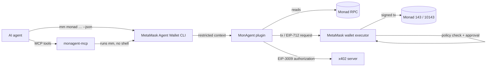

# MonAgent

**Give an AI agent a wallet that can pay, build trust and hire other agents on Monad, without it ever holding a private key.**

[](https://www.npmjs.com/package/@zakyirsyaad/monagent-plugin)
[](https://www.npmjs.com/package/@zakyirsyaad/monagent-mcp)

[](./LICENSE)

MonAgent is a plugin for the **MetaMask Agent Wallet** (`mm` CLI), built for the Monad Metropolis
Hackathon track *Best Agent Wallet Plugin*. It adds agent-to-agent commerce on **Monad mainnet (`143`)**
and **testnet (`10143`)**: payments, on-chain identity and reputation, paid API calls, and escrow.
Every transaction and signature is executed and policy-checked by MetaMask.

```bash
npm install -g @metamask/agent-wallet@7
mm config set experimentalPlugins true
mm config set experimentalAllowUnverifiedInstalls true
mm plugins install @zakyirsyaad/monagent-plugin --accept-permissions
mm monad identity get 1 --chain-id 143        # read an agent's on-chain identity, no login needed
```

## Why

- **Agents need to move money, but shouldn't hold keys.** MonAgent never touches keys. It builds a
  transaction and hands it to MetaMask, which applies its policy engine and can ask a human to approve.
- **Agents need to decide whom to trust.** Identity and reputation use the official **ERC-8004**
  registries on Monad, so an agent can check a counterparty's track record before paying it.
- **Agents buy and sell tool calls.** Paid APIs answering `402 Payment Required` are paid through
  **x402** with a signed USDC authorization, within a spending limit you set.
- **Agents subcontract work.** A small escrow contract holds a bounty until the client releases it.

## What an agent can do

| Need | Command | Built on |
|---|---|---|
| Pay another agent | `mm monad pay` | MON, USDC or any ERC-20 |
| Have an on-chain identity | `mm monad identity register` / `get` | ERC-8004 Identity Registry |
| Decide whether to trust a counterparty | `mm monad reputation check` | ERC-8004 Reputation Registry |
| Leave feedback after a job | `mm monad reputation give` | ERC-8004 Reputation Registry |
| Pay per call for a paid API | `mm monad x402 pay` | x402, EIP-3009 USDC |
| Hire an agent with funds in escrow (currently blocked — see [Status and limits](#status-and-limits)) | `mm monad jobs create` / `complete` / `refund` | `MonadA2AEscrow` (this repo) |

## Quickstart

You need Node.js 22+ and `@metamask/agent-wallet` **6.2+ or 7.x**.

```bash
npm install -g @metamask/agent-wallet@7
mm config set experimentalPlugins true
mm config set experimentalAllowUnverifiedInstalls true
mm plugins install @zakyirsyaad/monagent-plugin --accept-permissions

mm monad reputation check 1 --chain-id 143    # reads need no login or funds
mm login                                      # once, before any write
mm init                                       # first run only
```

Every command takes `--chain-id 10143|143` (default `10143`) and `--json` for machine-readable output.
Writes need MON for gas on the chain you write to; use mainnet (see [Status and limits](#status-and-limits)).

## Example: check, pay, rate

```bash
# 1. Is this agent trustworthy? (read-only; trust tier is HIGH, MEDIUM, LOW or UNRATED)
mm monad reputation check 1 --chain-id 143

# 2. Pay it (mainnet moves real funds)
mm monad pay --to 0x<agent wallet> --amount 5 --token USDC --chain-id 143

# 3. Leave feedback once the work is done (-100 to 100; you can't rate your own agent)
mm monad reputation give --agentId 1 --value 90 --tag1 quality --chain-id 143
```

The full command list, with every flag, is in [REFERENCE.md](./REFERENCE.md#command-reference).

## Use with AI agents

Any agent that can run shell commands can call `mm monad … --json`. Three packages make that easier:

| Route | What you get | Install |
|---|---|---|
| **Skill** | Rules, flows and an error-code table the agent reads | `mm monad skill --install claude-user` |
| **Claude Code plugin** | The skill, four workflow agents with slash commands, and the MCP server | `/plugin marketplace add zakyirsyaad/monagent` |
| **MCP server** | Nine typed tools for any MCP client | `claude mcp add monagent -- npx -y @zakyirsyaad/monagent-mcp` |

None of them holds keys. They run on the machine where `mm` is installed and signed in, and a person
still approves writes. Details, tool names and the MCP safety behavior are in
[REFERENCE.md](./REFERENCE.md#ai-agent-integrations).

The Claude Code plugin also ships four named workflow agents, each with its own skill and slash
command and the same guardrails (read first, confirm before every write, explicit chain, no blind
retries, stop on `[AWAITING_MFA]`):

| Workflow | Agent | Slash command | Writes |
|---|---|---|---|
| Vet a counterparty | `counterparty-vetter` | `/monad-vet <agentId> [chainId]` | no — read-only |
| Pay a vetted agent | `agent-payer` | `/monad-pay-agent <agentId> <amount> <token>` | yes — mainnet, after confirmation |
| Buy a paid API call | `api-buyer` | `/monad-buy-api <url>` | yes — x402, after confirmation |
| Register my agent | `identity-registrar` | `/monad-register-agent` | yes — mainnet, after confirmation |

There is deliberately no escrow or hiring workflow: escrow writes need testnet, and MetaMask
currently rejects testnet writes (see [Status and limits](#status-and-limits)).

## How it works



The plugin builds a transaction or an EIP-712 payload, and MetaMask decides whether to sign it. Along
the way it enforces a few rules:

- **Testnet by default**, and any chain other than `10143` or `143` is rejected before anything is signed.
- **x402 signs exactly what it checked.** It accepts one payment requirement on the requested chain,
  enforces your `--maxSpend`, then verifies the signer matches `--payer` before sending anything.
- **Only the client can release or refund an escrow job**; the worker can't pay itself.

## Status and limits

MonAgent is early (0.x). What to know before you rely on it:

- **Reads work on both chains; use mainnet for writes.** With `@metamask/agent-wallet` 7.0.0, MetaMask's
  wallet service answers `Invalid chainId` for writes on Monad testnet, so they wait on `Submitting...`
  and nothing is sent. This is a MetaMask service limit that the plugin can't work around.
- **Escrow exists only on testnet**, so `mm monad jobs …` can't complete a write through MetaMask today.
  The contract is covered by Foundry tests and contract simulation tests in this repo.
- **A person is always in the loop for writes:** `mm login` and `mm init` once, and each write can stop
  at `[AWAITING_MFA]` until approved in MetaMask.
- `--walletAddress` (identity) and `--memo` (payments) aren't stored on-chain.

## Reference

[REFERENCE.md](./REFERENCE.md) has the networks and contract addresses, every command with its flags,
the AI agent integrations in detail, and troubleshooting. The agent-facing guide is
[skills/monad-agent/SKILL.md](./skills/monad-agent/SKILL.md).

## Development

```bash
npm install
npm run typecheck
npm test --workspace @zakyirsyaad/monagent-plugin
npm test --workspace @zakyirsyaad/monagent-mcp
node --test scripts/*.test.mjs
(cd contracts && forge test)
```

```
packages/plugin-monad/   the mm plugin
packages/mcp-monad/      MCP server that wraps the mm CLI
claude-plugin/           Claude Code plugin (workflow agents, slash commands, workflow skills, .mcp.json)
.claude-plugin/          Claude Code marketplace manifest
contracts/               MonadA2AEscrow + Foundry tests
skills/monad-agent/      shared agent skill (SKILL.md), synced into claude-plugin/ and the npm package;
                         the four workflow skills are sourced in claude-plugin/skills/ only
scripts/                 deploy, demo and repo checks
```

`npm run demo:local` walks through the main flows against a **mocked** host and prints placeholder
transaction hashes; use the `mm` commands above for a real demonstration.

## License

[MIT](./LICENSE) © 2026 Zaky Irsyad Rais
